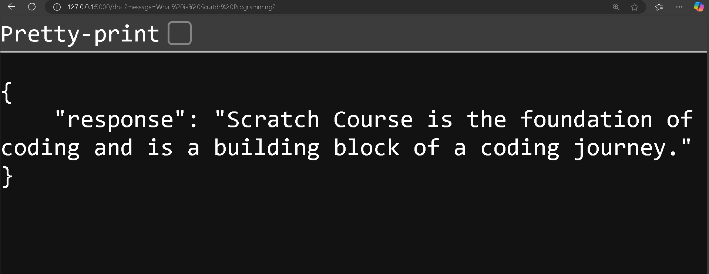
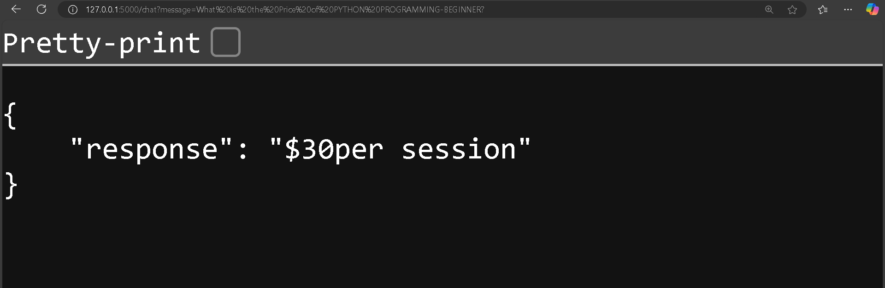

# LangChain Chatbot with Flask REST API




## Overview
This project is a Flask RESTful API chatbot that extracts data from a given website, creates embeddings, stores them in a vector database, and enables users to interact with the chatbot via API endpoints.

## Features
- **Extract Data:** Uses `WebBaseLoader` from LangChain to scrape data from `https://brainlox.com/courses/category/technical`.
- **Embeddings & Vector Store:** Utilizes `GoogleGenerativeAIEmbeddings` and `FAISS` for semantic search.
- **Flask RESTful API:** Provides endpoints to interact with the chatbot.
- **Memory Support:** Implements `ConversationBufferMemory` to track previous messages.
- **Custom Prompt:** Ensures responses are contextually accurate.

## Tech Stack
- **Python** (Flask, Flask-RESTful)
- **LangChain** (Document Loader, Text Splitter, Embeddings, Vector Store, RetrievalQA)
- **Google Generative AI** (Embeddings & Chat Model)
- **FAISS** (Vector Database)
- **dotenv** (Environment Variable Management)

## Installation
### Prerequisites
- Python 3.9+
- Google API Key (Set in a `.env` file)

### Steps
1. Clone the repository:
   ```bash
   git clone https://github.com/PriyanshuDey23/Triluxo-Technologies.git
   cd <repo_folder>
   ```
2. Install dependencies:
   ```bash
   pip install -r requirements.txt
   ```
3. Set up the `.env` file with your Google API Key:
   ```
   GOOGLE_API_KEY=your_api_key_here
   ```
4. Run the Flask server:
   ```bash
   python main.py
   ```

## API Endpoints
### 1. Home Route
**GET `/`**  
_Response:_
```json
{"message": "Welcome to the LangChain Chatbot"}
```

### 2. Chat Route
**GET `/chat?message=your_question`**  
**POST `/chat`** (JSON Body: `{ "message": "your_question" }`)

_Response Example:_
```json
{"response": "The answer to your question..."}
```

## License
This project is open-source under the MIT License.

